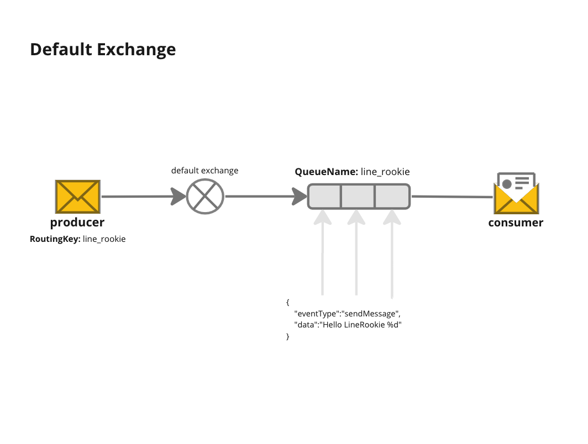

**Run Setting**
```go sh
go run default-exchange/setting.go
```

**Run Consumer**
```go sh
QUEUE=line_rookie go run consumer.go
```

**Run Producer**
```go sh
EXCHANGE_NAME="" ROUTING_KEY=line_rookie go run producer.go
```
