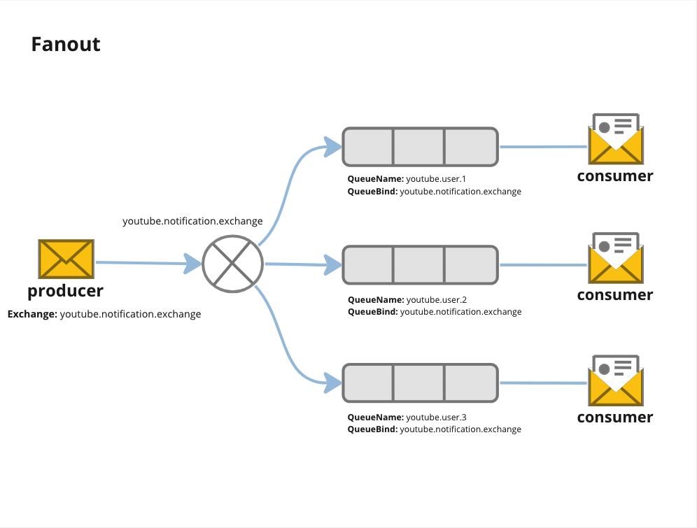

**Run Setting**
```go sh
QUEUE=youtube.user.1 go run fanout-exchange/setting.go
QUEUE=youtube.user.2 go run fanout-exchange/setting.go
QUEUE=youtube.user.3 go run fanout-exchange/setting.go
```

**Run Consumer**
```go sh
QUEUE=youtube.user.1 go run consumer.go
QUEUE=youtube.user.2 go run consumer.go
QUEUE=youtube.user.3 go run consumer.go
```

**Run Producer**
```go sh
EXCHANGE_NAME=youtube.notification.exchange ROUTING_KEY="" go run producer.go
```