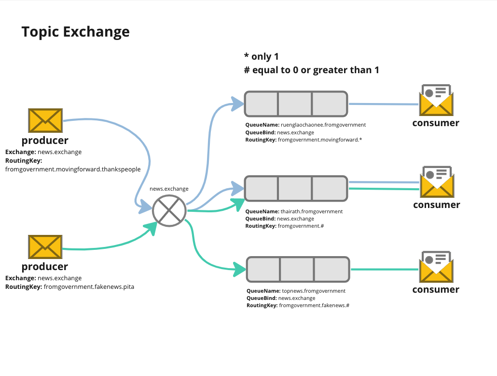

**Run Setting**
```go sh
QUEUE=ruenglaochaonee.fromgovernment ROUTING_KEY=fromgovernment.movingforward.* go run topic-exchange/setting.go
QUEUE=thairath.fromgovernment ROUTING_KEY=fromgovernment.# go run topic-exchange/setting.go
QUEUE=topnews.fromgovernment ROUTING_KEY=fromgovernment.fakenews.# go run topic-exchange/setting.go
```

**Run Consumer**
```go sh
QUEUE=ruenglaochaonee.fromgovernment go run consumer.go
QUEUE=thairath.fromgovernment go run consumer.go
QUEUE=topnews.fromgovernment go run consumer.go
```

**Run Producer**
```go sh
EXCHANGE_NAME="news.exchange" ROUTING_KEY=fromgovernment.movingforward.thankspeople go run producer.go
EXCHANGE_NAME="news.exchange" ROUTING_KEY=fromgovernment.fakenews.pita go run producer.go
```